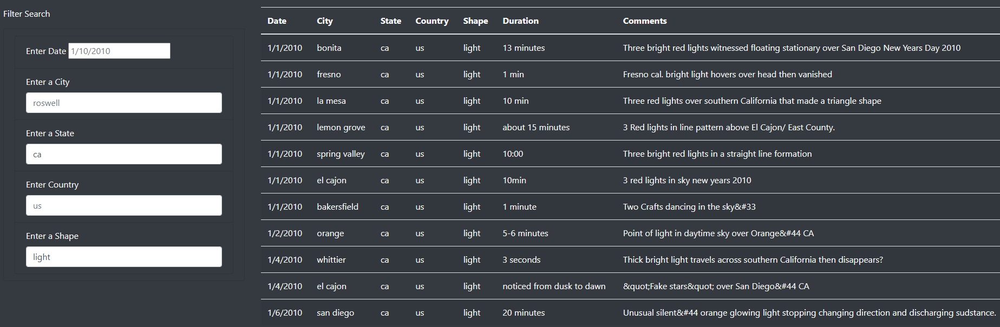

## Overview of the project

In this module, we'll build a table using data stored in a JavaScript array. We'll also create filters to make this table fully dynamic, meaning that it will react to user input, and then place the table into an HTML file for easy viewing.

We'll use and apply:
* Use console.log() to debug code
* Create variables with var and let
* Use d3.select()
* Use JavaScript functions
* Use arrow functions
* Use forEach() with JavaScript objects
* Use filters with d3.select()
* Write if-else statements
* Add list-group-item class, label, and input tags to add filtered data to an index.html file
* Add the script tags for your code to an index.html file

## Results

1. We removed the "filter date" button and we added 4 new elements to get input from the user: Country, State, City and shape.

2. We replaced the handleClick() function in our app.js file with a new function that saves the element, value, and id of the filter that was changed every time the user provides new criteria fot the search.

## Summary

* Drawback of this webpage
When the webpage shows the entire data we can't see the column headers if we scroll down and get the user's input could be easier to handle when having a drop down menu.

* Additional recommendations for further development.
1. Frezzing the column headers
2. Adding a drop down mwenu on every filter based on the current data.
